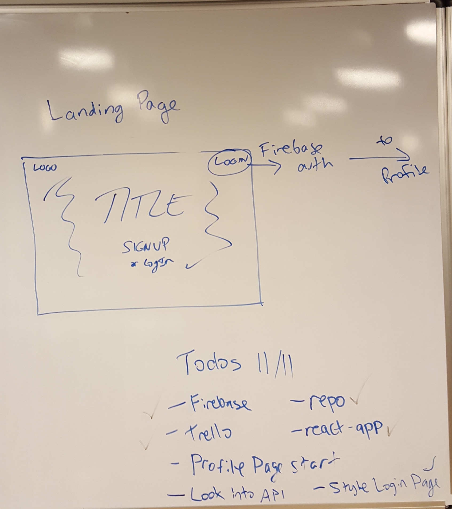
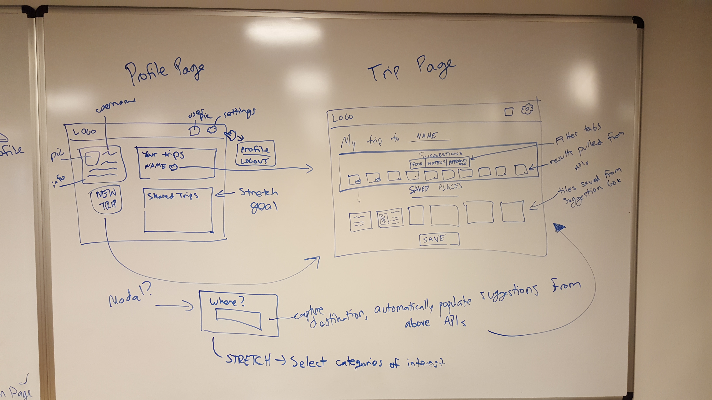

# Tripfolio

## Background:
Tripfolio was built as a group project at General Assembly's coding bootcamp in Austin during November 2016.

## Tripfolio Team:
- Project Lead: Clark Sanford
- Developers: Clark Sanford, Kelvan Ince, Joseph Callaway
- UX Designers: Emma Lacouture, Kati Prather

## Clark’s Inspiration for Tripfolio:

Tripfolio is a web app designed to overhaul the travel planning experience by allowing users to save recommendations and share them with others. As an avid traveler and a very type A person, I personally find that planning a trip is nearly as fun as the trip itself. However, a key problem for me has always been the fact that all of the information about things to do and sights to see is spread out and hard to bring together: you find a museum in a guidebook that sounds intriguing, Yelp gives you a few restaurant ideas, a friend has told you that you HAVE to try this hip coffee shop. How can you bring all of these together?

My workaround was always Google docs. I would simply copy and paste information I found from blogs, guide books, and friends’ recommendations into a blank, white Google doc. But that isn’t very engaging or exciting! Thus arose the inspiration for Tripfolio, a site that would allow users to cull their travel-related information into one centralized location, with a heavy visual focus.

## The Process:

The app was built over the course of a week with a group of three web dev students and in collaboration with two UX Design students from one of General Assembly's other courses. We (the developers) came up with initial functionality, wireframes, and user flow, which we then passed off to the designers. Our UX teammates then modified our original designs based on user feedback and, at the halfway point, gave us full wireframes for each page of the site, as well as a style guide. There were several intermediate meetings where the designers presented their ideas for new features and we discussed the feasibility of accomplishing those ideas within the course of a week. This was our first time collaborating with students from another course, and it was a very enriching and informative experience. We worked well together thanks to clear communication on both sides.

## Dev Technologies Used:
- Atom
- Bootstrap
- Firebase
- Git
- Heroku
- React
- Trello

## Design Technologies Used:
- Balsamic
- Photoshop

## Initial Wireframes

## UX Presentation

Click [here](https://docs.google.com/presentation/d/1bBvZ8I4EWvXMrD3WCKbjOsFLi1NUKut9QpK73XG8yhI/edit?usp=sharing) to see the final mock-ups, as well as a more in-depth presentation of the work the UX designers did.
